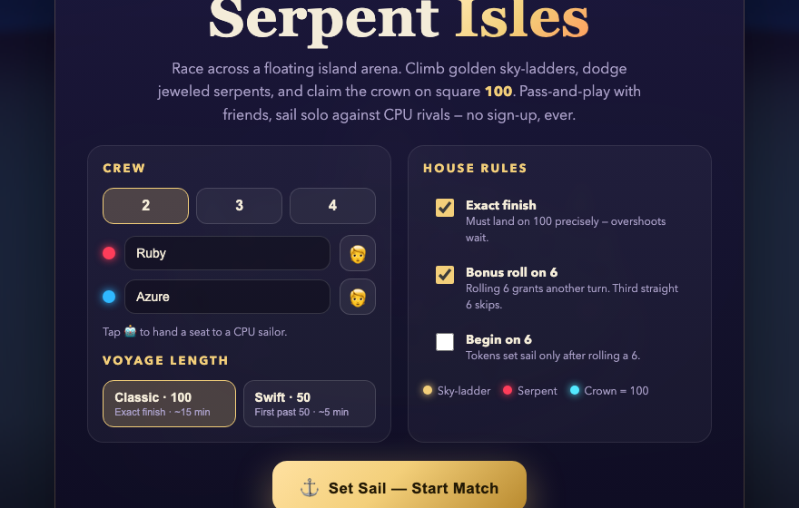
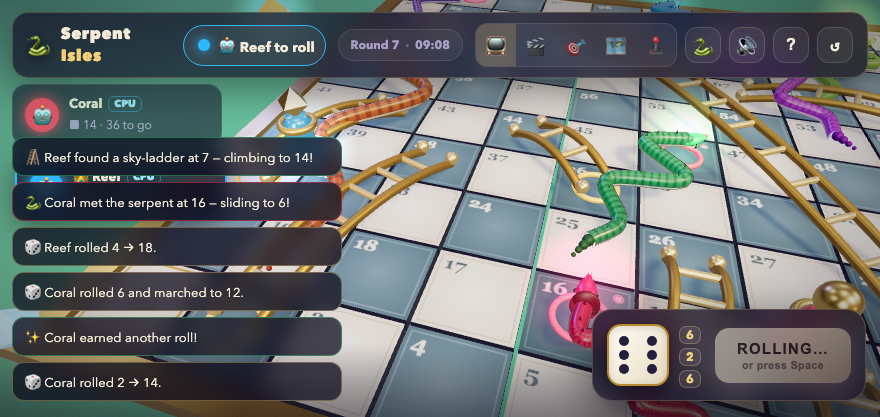

# 🐍 Serpent Isles — Cinematic 3D Snakes & Ladders

[](https://github.com/Rajath4/Serpent-Isles/actions/workflows/ci.yml)
[](https://github.com/Rajath4/Serpent-Isles/actions/workflows/deploy.yml)
[](./LICENSE)

A premium, highly-polished **3D Snakes & Ladders** game for **2–4 local players** (pass-and-play)
**plus CPU sailors** for solo voyages. Built with **Three.js + Vite + TypeScript** — every 3D asset
is **generated procedurally in code**: no downloads, no external models.

**▶ [Play it now](https://rajath4.github.io/Serpent-Isles/)**
· 100% offline · installable PWA · zero tracking · no sign-up, ever.

|  |  |
|---|---|
| Crew, voyage length & house rules | The director's tracking shot mid-match |

## ✨ Highlights

- **Floating-island arena** — sunset sky, glowing sea, palms, crystals, braziers, fireflies, drifting clouds, stars
- **Gallery-grade serpents** — PBR jewel skin, sculpted hooded heads, amber eyes, darting tongues, dorsal spines
- **Arcane dice ritual** — rounded casino die, charge-up, corkscrew launch, spark trail, slow-mo slam, settling bounces, result flash
- **🔊 Zero-asset sound design** — every effect synthesized live (rattles, glissandi, thuds, chimes, denial bonks, fanfare) over a breathing music-box bed, glued by a master compressor
- **🤖 CPU sailors** — hand any seat to the computer; mixed crews welcome
- **⚡ Swift voyage** — first past 50 in ~5 min, alongside the classic exact-100 epic
- **⛵ Save/resume** — every turn auto-saves locally; interruptions lose nothing
- **👑 Hall of Fame** — local legends, dice-fairness proof, fortune favorites
- **📺 Auto-director camera** — top overview at rest, dice close-ups, action tracking, idle drift, instant manual override
- **Adaptive performance** — Eco/Balanced/Cinematic tiers from real GPU capability (renderer string, cores, memory, pointer) with manual override; 120Hz+ panels get half-rate presentation; forgiving live governor trims only on sustained weakness and climbs back fast
- **Party UX** — pause menu, haptics, share-victory, pass-the-device toasts, race tracker, match feed, win confetti

## 🚀 Run it locally

```bash
npm install
npm run dev      # → http://localhost:5173
npm run build    # typecheck + production build → dist/
npm run preview  # serve the production build → http://localhost:4173
```

Tip: open `?quickplay` for an instant self-playing demo voyage (great for smoke tests).

## 🎮 How to play

1. Pick 2–4 seats, name your crew (tap 🤖 for CPU sailors), choose Classic/Swift + house rules → **Set Sail**.
2. Current player hits **ROLL DICE** (or `Space`); pass the device around. `Esc` pauses.
3. Gold rings = ladders up · red rings = serpents down.
   Classic: exact **100** takes the crown · Swift: first past **50**.
4. Hover any tile to spotlight its serpent or ladder. The 🐍 button fades (👻) or hides all routes.

| Input | Action |
|---|---|
| `Space` / ROLL | Roll the dice |
| Drag / scroll | Orbit / zoom (director yields instantly) |
| `C` | Cycle cameras (📺 auto · 🎬 cine · 🎯 follow · 🗺️ top · 🕹️ free) |
| `M` / `H` / `Esc` | Mute · help · pause |
| Hover a tile | Peek its fate (🪜 climbs to / 🐍 slides to) |

**House rules:** exact finish · bonus roll on 6 (3rd straight 6 forfeits) · start-on-6 · voyage length.

## 🌐 Deploy your own copy

1. Fork this repo (or push this folder as its own repo).
2. GitHub → **Settings → Pages → Source: GitHub Actions**. Push to `main` — the
   `deploy.yml` workflow builds and publishes automatically.
3. Optional: add a custom domain under Settings → Pages (HTTPS is enforced).

Local preview of the production build behaves exactly like Pages: `npm run build && npm run preview`.

## 🔒 Privacy by design

No accounts, no analytics, no network calls in game code — the only fetches are the
app's own files (plus service-worker caching for offline play). Everything lives in
your browser's `localStorage`, and every entry is gameplay-only:

| Key | What |
|---|---|
| `serpent-crew` | Last crew names, CPU seats, rules |
| `serpent-save` | Mid-match snapshot for Resume |
| `serpent-hof` | Hall of Fame wins/games per name |
| `serpent-routes` / `serpent-director` / `serpent-quality` | UI preferences |

Clear site data and it's all gone. Audiences of any age: no chat, no ads, no purchases.

## 🧱 Project layout

```
src/
  main.ts            UI wiring, HUD, CPU drivers, save/resume, HoF, PWA, screens
  style.css          luxe glassmorphism theme, responsive + reduced-motion
  game/
    constants.ts     board math, digital-edition route layout, rules, CPU names
    quality.ts       Eco/Balanced/Cinematic detection + presets
    environment.ts   sky, sea, island, flora, crystals, torches, particles
    board.ts         merged tiles, gold frame, rings, crown + goal beacons
    snakes.ts        PBR serpents, sculpted heads, tongue AI, slide curves
    ladders.ts       arched golden ladders, climb curves
    tokens.ts        jewel champions, halos
    dice.ts          rounded casino die + 5-phase arcane throw
    effects.ts       pooled spark bursts + shockwave rings
    merge.ts         bulletproof geometry merging + static-matrix freezing
    Game.ts          renderer, auto-director, turn engine, snapshots, perf governor
    audio.ts         zero-asset WebAudio SFX + generative music-box ambience
public/              favicon, app icons, manifest, offline service worker
docs/screenshots/    setup + gameplay captures
.github/             Pages deploy + CI workflows, issue/PR templates
```

## 🤝 Contributing

Issues and PRs are welcome! Please read `.github/pull_request_template.md` first —
the short version: `npx tsc --noEmit` clean, `npm run build` green, play a full match
(`?quickplay` counts), check a ≤400px viewport, keep it offline-first and telemetry-free.

**Roadmap ideas:** night/ocean island themes · 5–6 player seats · match highlights reel.

## 📄 License

[MIT](./LICENSE) © 2026 Rajath — sculpt serpents freely, just keep the notice. 🌊
